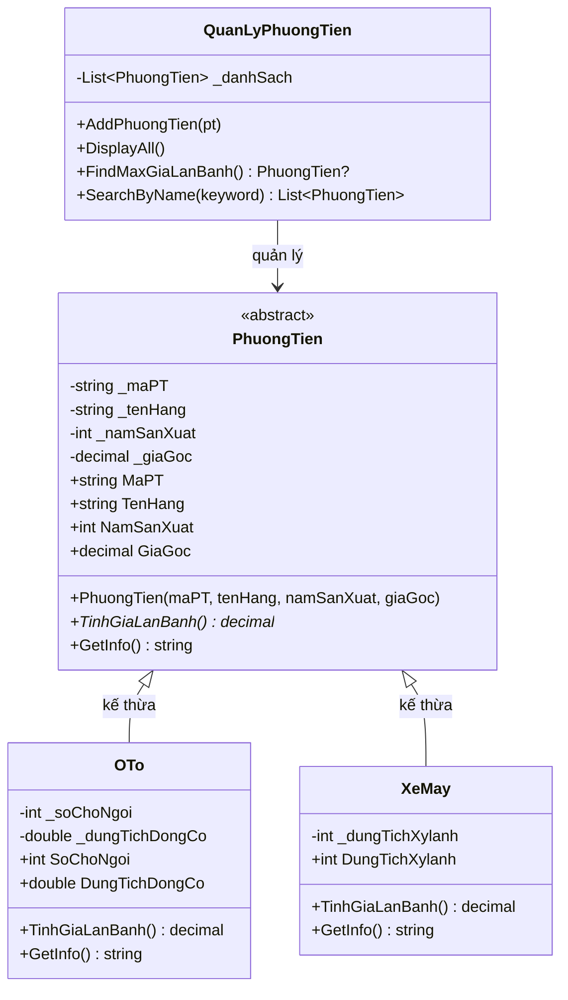

# 🚗 Hệ thống Quản lý Phương tiện — AutoSpeed Logistics

> **Bài Kiểm Tra 01 — Phần II: Lập trình OOP**
> Môn: Lập trình C# / .NET | Sinh viên: Phạm Tuấn Thành | Công nghệ: .NET 8 · C# 12

---

## 📋 Mô tả bài toán

Công ty Logistics **AutoSpeed** cần một hệ thống quản lý đội xe, áp dụng đầy đủ **4 trụ cột OOP**:

- **Encapsulation** — dữ liệu phương tiện được bảo vệ qua private fields + properties có validation
- **Inheritance** — `OTo` và `XeMay` kế thừa từ `PhuongTien`
- **Polymorphism** — mỗi loại xe tính thuế/giá lăn bánh theo công thức riêng, gọi qua kiểu cha
- **Abstraction** — `PhuongTien` là `abstract class`, không thể tạo thể hiện trực tiếp

---

## 🗂️ Cấu trúc thư mục

```
autospeed-vehicle-management-oop/
├── .gitignore
├── AutoSpeed.sln
├── src/
│   └── AutoSpeed/
│       ├── AutoSpeed.csproj          # net8.0, Nullable enable
│       ├── Program.cs                # Demo + 5 test case in PASS/FAIL
│       ├── Models/
│       │   ├── PhuongTien.cs         # abstract class (Encapsulation + Abstraction)
│       │   ├── OTo.cs                # Kế thừa, override TinhGiaLanBanh + GetInfo
│       │   └── XeMay.cs              # Kế thừa, override TinhGiaLanBanh + GetInfo
│       └── Services/
│           └── QuanLyPhuongTien.cs   # Quản lý List<PhuongTien>, Đa hình
└── docs/
    └── (ảnh chụp console output)
```

---

## 🏗️ Sơ đồ lớp



---

## 📐 Bảng truy vết yêu cầu

| Mã YC | Nội dung yêu cầu | File / Dòng | Trạng thái |
|-------|-----------------|-------------|-----------|
| R-OOP-01 | `PhuongTien` là abstract class | `Models/PhuongTien.cs` | ✅ Đạt |
| R-OOP-02 | 4 private fields `_maPT, _tenHang, _namSanXuat, _giaGoc` | `PhuongTien.cs` L9-12 | ✅ Đạt |
| R-OOP-03 | `MaPT`: trống → mặc định "PT000" | `PhuongTien.cs` setter | ✅ Đạt |
| R-OOP-04 | `TenHang`: không được trống | `PhuongTien.cs` setter | ✅ Đạt |
| R-OOP-05 | `NamSanXuat`: [1900..năm hiện tại], sai → `ArgumentException` | `PhuongTien.cs` setter | ✅ Đạt |
| R-OOP-06 | `GiaGoc` > 0 | `PhuongTien.cs` setter | ✅ Đạt |
| R-OOP-07 | Constructor gán qua property | `PhuongTien.cs` ctor | ✅ Đạt |
| R-OOP-08 | `abstract decimal TinhGiaLanBanh()` | `PhuongTien.cs` | ✅ Đạt |
| R-OOP-09 | `virtual string GetInfo()` | `PhuongTien.cs` | ✅ Đạt |
| R-OOP-10 | `OTo.SoChoNgoi` > 0, `DungTichDongCo` > 0 | `Models/OTo.cs` | ✅ Đạt |
| R-OOP-11 | `OTo.TinhGiaLanBanh()`: ≤9 chỗ = +12%+30%; >9 chỗ = +10% | `OTo.cs` | ✅ Đạt |
| R-OOP-12 | `OTo.GetInfo()` bổ sung số chỗ + dung tích | `OTo.cs` | ✅ Đạt |
| R-OOP-13 | `XeMay.DungTichXylanh` (cc) | `Models/XeMay.cs` | ✅ Đạt |
| R-OOP-14 | `XeMay.TinhGiaLanBanh()`: <175cc = +2%; ≥175cc = +5% | `XeMay.cs` | ✅ Đạt |
| R-OOP-15 | `QuanLyPhuongTien.AddPhuongTien()` | `Services/QuanLyPhuongTien.cs` | ✅ Đạt |
| R-OOP-16 | `QuanLyPhuongTien.DisplayAll()` | `Services/QuanLyPhuongTien.cs` | ✅ Đạt |
| R-OOP-17 | `FindMaxGiaLanBanh()` dùng đa hình | `Services/QuanLyPhuongTien.cs` | ✅ Đạt |
| R-OOP-18 | `SearchByName()` dùng LINQ, không phân biệt hoa thường | `Services/QuanLyPhuongTien.cs` | ✅ Đạt |

---

## 🧪 Kết quả kiểm thử

| TC | Kịch bản | Kết quả kỳ vọng | Kết quả thực tế | Trạng thái |
|----|----------|-----------------|-----------------|-----------|
| TC01 | `NamSanXuat = 1850` | `ArgumentException("Năm sản xuất không hợp lệ!")` | ArgumentException đúng message | ✅ PASS |
| TC02 | Ô tô 5 chỗ, 1 tỷ | Giá lăn bánh = 1,420,000,000 | 1,420,000,000 VNĐ | ✅ PASS |
| TC03 | Xe máy 150cc, 50 triệu | Giá lăn bánh = 51,000,000 | 51,000,000 VNĐ | ✅ PASS |
| TC04 | Đa hình `List<PhuongTien>` | Mỗi xe tính đúng công thức | Hoạt động đúng | ✅ PASS |
| TC05 | `FindMaxGiaLanBanh()` | Trả đúng ô tô 1.42 tỷ | Trả OTo 1.42 tỷ | ✅ PASS |

### Test biên

| Trường hợp | Kết quả kỳ vọng |
|-----------|-----------------|
| OTo đúng 9 chỗ | Áp dụng công thức ≤9 chỗ (+12%+30%) |
| OTo đúng 10 chỗ | Áp dụng công thức >9 chỗ (+10%) |
| XeMay 174cc | 2% trước bạ |
| XeMay 175cc | 5% trước bạ |
| `GiaGoc = 0` | `ArgumentException` |
| `NamSanXuat = 1899` | `ArgumentException` |
| `NamSanXuat = 1900` | Hợp lệ |
| `MaPT` rỗng | Gán mặc định "PT000" |
| `SearchByName("")` | Trả toàn bộ danh sách |
| `FindMaxGiaLanBanh()` khi rỗng | Trả `null` |

---

## 🚀 Cách chạy

```bash
# Yêu cầu: .NET 8 SDK trở lên
dotnet run --project src/AutoSpeed
```

Mở bằng **Visual Studio 2022**: mở file `AutoSpeed.sln`.

---

## 💡 Giả định & Quyết định thiết kế

| Điểm mơ hồ | Cách xử lý |
|------------|-----------|
| `MaPT`: "Nối khoảng trắng" (gõ nhầm?) | Hiểu là chuỗi trống/khoảng trắng → mặc định "PT000" |
| `DungTichXylanh` không nêu ràng buộc | Thêm validation > 0 (ghi nhận là giả định bổ sung) |
| `FindMaxGiaLanBanh()` khi danh sách rỗng | Trả `null`, kiểu trả về `PhuongTien?` |
| `SearchByName("")` | Trả toàn bộ danh sách |

---

## ❓ Câu hỏi vấn đáp thường gặp

**Q: 4 trụ cột OOP nằm ở đâu trong code?**
- **Encapsulation**: `PhuongTien` — private fields + properties validation
- **Inheritance**: `OTo`, `XeMay` kế thừa từ `PhuongTien`
- **Polymorphism**: `QuanLyPhuongTien.DisplayAll()` gọi `TinhGiaLanBanh()` qua kiểu cha
- **Abstraction**: `PhuongTien` là abstract class, không tạo trực tiếp được

**Q: Vì sao dùng `decimal` thay vì `double` cho tiền?**
> `double` có sai số dấu phẩy động (floating point). `decimal` có độ chính xác 28-29 chữ số — bắt buộc khi tính tiền.

**Q: Vì sao constructor gán qua property?**
> Để validation chạy ngay khi khởi tạo. Nếu gán thẳng vào `_field`, validation trong setter bị bỏ qua.

**Q: `virtual` khác `abstract` ở điểm gì?**
> `virtual` có thể override hoặc không (có body mặc định). `abstract` bắt buộc override, không có body.

---

## 🛠️ Yêu cầu môi trường

- .NET 8 SDK (`dotnet --version` ≥ 8.0)
- Windows / macOS / Linux đều chạy được
